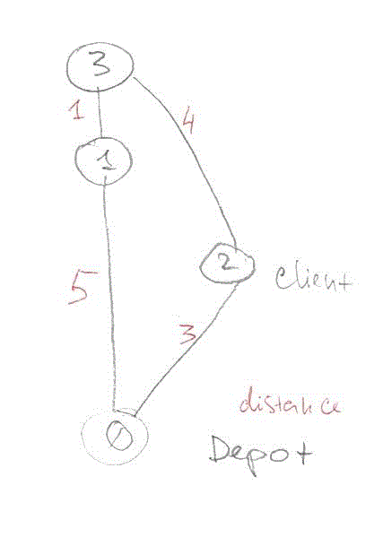

# OR-Tools Samples

Java is not favorite language among supported by [Google's or-tools project](https://developers.google.com/optimization/). This repo is a collection of `Java` samples to facilitate learning of or-tools project. The or-tools project source code has more Java samples in main [or-tools github repository](https://github.com/google/or-tools/tree/master/examples/com/google/ortools/samples).

## Running samples
Users are welcome to use IDE of their choice but any sample in this repository can be run by command line:
```shell
$ javac @options.arg src\samples\SimpleRoutingTest.java
$ java -cp "out;lib\*" -Djava.library.path=lib\rt  samples.SimpleRoutingTest
```

These java examples use Google OR-TOOLS routing APIs v6.2 [Release 6.2.4388](https://github.com/google/or-tools/releases/tag/v6.2) 

## Samples

Route map used in samples.  

[SimpleRoutingTest](./blob/master/src/samples/SimpleRoutingTest.java) - simplest test. Search of a shortest path for single vehicle to go around all customers.

[SimpleRoutingMultiVehicles](./blob/master/src/samples/SimpleRoutingMultiVehicles.java) - search for optimal solution with two vehicles.

